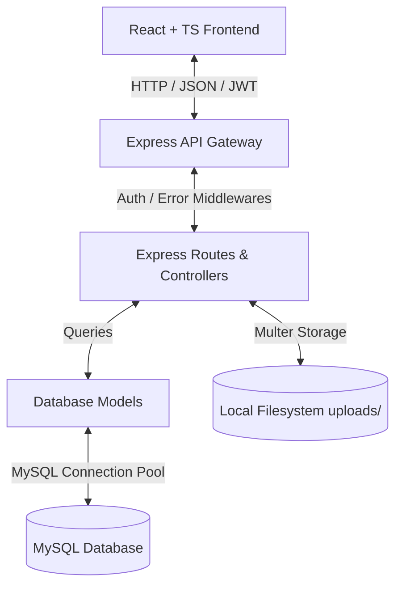
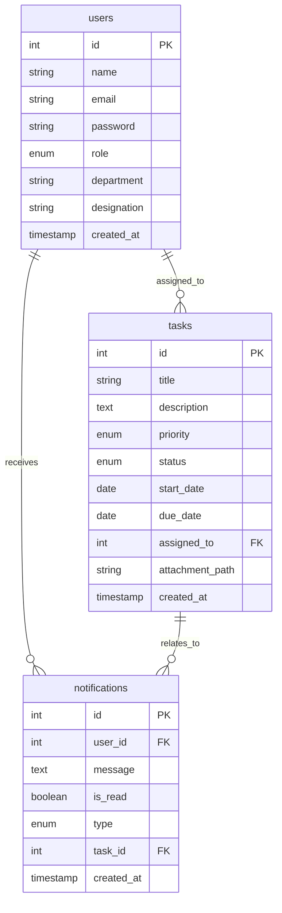
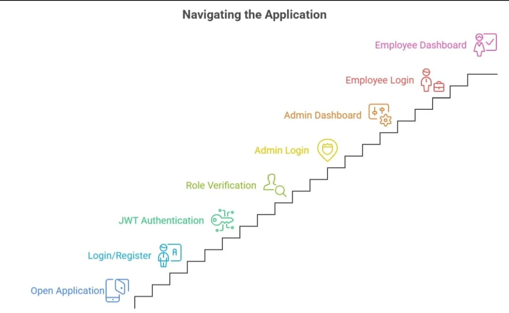
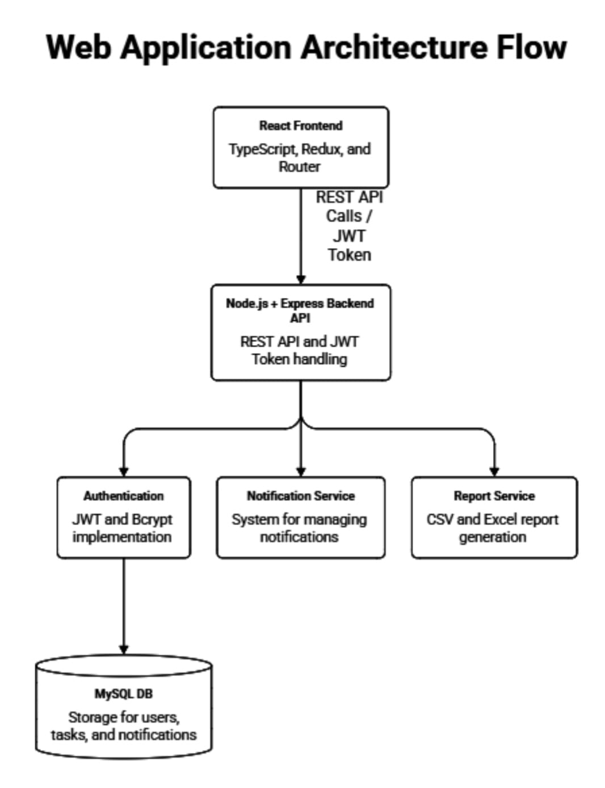

# TaskForce: Employee Task Management System

TaskForce is a production-quality, responsive Employee Task Management System designed with clean layered architecture, role-based authorization, and real-time activity indicators.

---

## Technical Stack

- **Frontend**: React, TypeScript, Redux Toolkit, React Router, Vanilla CSS Design System.
- **Backend**: Node.js, Express.js.
- **Database**: MySQL.
- **File Uploads**: Multer (Local storage for PDFs, JPGs, PNGs up to 5 MB).
- **Authentication**: Stateless JSON Web Token (JWT) with optional Remember Me persistence.
- **Reports Export**: CSV (via `json2csv`) and Excel (via `exceljs` binary streams).

---

## System Architecture



---

## Database Relations Schema



---

## Key Features

1. **Authentication**: Secured JWT authentication with role checkguards, profile details fetching, and optional remember-me.
2. **Admin Console**: Full access to employee profiles, task assignment, real-time dashboards with trends graphs, and reporting.
3. **Employee Workspace**: Visual list of assigned tasks, interactive progress indicators, status updating console, and activity alerts.
4. **Impending Deadline Scanner**: Background checker runs hourly to warn assignees if a task is due in under 24 hours.
5. **Activity Log Notifications**: Instant feedback on task assignment, modification, and completion.
6. **Reporting & Exports**: Tabular summaries of finished vs pending workloads, with formatted CSV/Excel binary streaming downloads.

---

## Local Setup & Installation

### Prerequisites
- Node.js (v18+)
- MySQL instance running on localhost (default port 3306)

### 1. Database Configuration
Run the schema initialization script:
```bash
# Log in to your MySQL terminal and execute:
mysql -u root -p < schema.sql
```
*Note: Make sure database configurations in `backend/.env` are updated.*

### 2. Backend Setup
```bash
cd backend
npm install
npm run start
```
The backend server runs on `http://localhost:5000`.

### 3. Frontend Setup
```bash
cd frontend
npm install
npm run dev
```
The Vite development server runs on `http://localhost:5173` (or the next available port).

---

## Docker Setup

To orchestrate the environment (Database, Backend, and Frontend containers) in one command:

```bash
docker-compose up --build
```

- **Frontend Dashboard**: `http://localhost:3000`
- **Backend API Server**: `http://localhost:5000`
- **MySQL Database**: `localhost:3306`

---

## API Summary Documentation

### Authentication
- `POST /api/auth/register` - Create user (Full Name, Email, Password, Role)
- `POST /api/auth/login` - Verify password and return JWT + user profile details
- `POST /api/auth/logout` - Invalidate session
- `GET /api/auth/profile` - Get logged-in user profile details

### Employee Directory (Admin Only)
- `GET /api/employees` - Paginated, sorted list of employees (with `?search=...` filter)
- `POST /api/employees` - Register a new employee
- `PUT /api/employees/:id` - Edit employee designation/department
- `DELETE /api/employees/:id` - Remove employee account

### Tasks
- `GET /api/tasks` - List tasks (Admin sees all; Employee sees assigned only. Filterable by status/priority)
- `GET /api/tasks/dashboard` - Stats cards totals and visual trends data
- `POST /api/tasks` - Create task with optional file attachment upload (Admin Only)
- `PUT /api/tasks/:id` - Update task (Admin modifies all fields; Employee updates status only)
- `DELETE /api/tasks/:id` - Delete task (Admin Only)

### Notifications
- `GET /api/notifications` - Retrieve chronological activity log notifications
- `PUT /api/notifications/:id/read` - Mark single alert as read
- `PUT /api/notifications/read-all` - Mark all alerts as read

### Reports (Admin Only)
- `GET /api/reports/completed` - Retrieve list of finished tasks
- `GET /api/reports/pending` - Retrieve list of active tasks
- `GET /api/reports/employee-wise` - Aggregate breakdown count by employee
- `GET /api/reports/export/csv?type=...` - Stream CSV file download
- `GET /api/reports/export/excel?type=...` - Stream formatted Excel sheet download

## Application Flow Diagram



---

## Architecture Diagram

